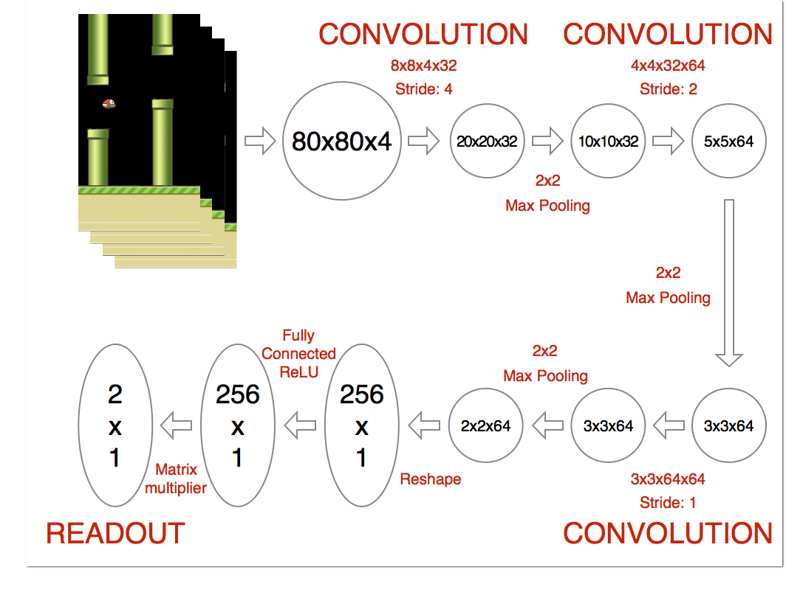

Space Invaders
===========


Report
------

## [Scheme of neural network](https://github.com/yenchenlin/DeepLearningFlappyBird)



Trailer on [Youtube](https://www.youtube.com/watch?v=uPUkDQnqzR4&feature=youtu.be) with the example of the work the trained network.


##Comments on the results of study

Network finally too afraid to die. Therefore, the player is hammered into a corner and sticking there, despite the negative reward over time. The network thus retrained.


##Final specifications

There are 4 ACTIONS={do nothing, left, right, bullet}

The final formula(reward):
* left or right movement: +0.1
* if bullet hit enemy: +1
* if bullet hit us: -1
* if GameOver: -2


##Comparison with random algorithm

After 150000 learning iterations, result of our neural networks is comparable to the result from the random algorithm.


##What has been done

There is only one thing, which was changed. It is reward.

For example, if reward of doing nothing = 0.1 instead 0, then our Ship is hammered into a corner and sticking there.


## Installation Dependencies:
* Python 2.7 or 3
* TensorFlow 0.7
* pygame
* OpenCV-Python


This project has been taken from the [GitHub](https://github.com/leerob/Space_Invaders)

## How to Run?
```
cd Space_Invaders
python2 deep_q_network.py
